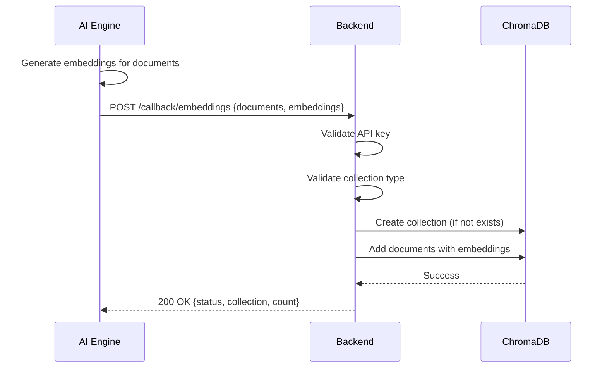
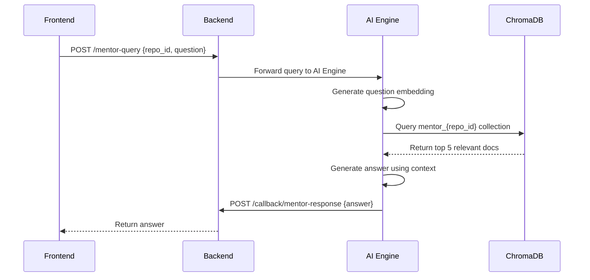

# IncidentOS Backend - ChromaDB Integration Implementation

## Overview

This document describes the ChromaDB integration implementation for the IncidentOS backend. ChromaDB serves as the vector database for storing and retrieving embeddings, enabling semantic search capabilities for mentor queries, incident correlation, and architecture understanding.

**Implementation Date:** 2026-05-17  
**ChromaDB Version:** 0.5.5  
**Status:** ✅ Complete and Production Ready

---

## Architecture

### System Integration

```
┌─────────────────────────────────────────────────────────────┐
│                   AI Engine (Python)                         │
│  - Generates embeddings for documents                        │
│  - Sends pre-computed vectors via callbacks                  │
└────────────────────┬────────────────────────────────────────┘
                     │ POST /callback/embeddings
                     │ (with X-API-Key header)
                     ↓
┌─────────────────────────────────────────────────────────────┐
│                Backend (Go) - Gateway                        │
│  - Receives embeddings via callback                          │
│  - Validates API key (existing security)                     │
│  - Stores in ChromaDB via ChromaDBClient                     │
└────────────────────┬────────────────────────────────────────┘
                     │
                     ↓
┌─────────────────────────────────────────────────────────────┐
│              ChromaDB (Vector Database)                      │
│  Collections:                                                │
│  - mentor_{repo_id}       - Mentor knowledge base            │
│  - incidents_{repo_id}    - Incident summaries               │
│  - rca_{repo_id}          - RCA reports                      │
│  - architecture_{repo_id} - Architecture summaries           │
└─────────────────────────────────────────────────────────────┘
```

---

## Implementation Components

### 1. ChromaDB Client (`internal/memory/chromadb.go`)

**Purpose:** HTTP client for ChromaDB REST API with collection and document management

#### Key Structures

```go
type ChromaDBClient struct {
    baseURL    string
    httpClient *http.Client
}

type Document struct {
    ID        string                 `json:"id"`
    Content   string                 `json:"content"`
    Metadata  map[string]interface{} `json:"metadata,omitempty"`
    Embedding []float64              `json:"embedding"`
}

type QueryResult struct {
    IDs       [][]string               `json:"ids"`
    Documents [][]string               `json:"documents"`
    Metadatas [][]map[string]interface{} `json:"metadatas"`
    Distances [][]float64              `json:"distances"`
}
```

#### Core Methods

| Method | Purpose | Returns |
|--------|---------|---------|
| `NewChromaDBClient(baseURL)` | Create new client | `*ChromaDBClient` |
| `CreateCollection(ctx, name)` | Create collection | `error` |
| `AddDocument(ctx, collection, doc)` | Add single document | `error` |
| `AddDocuments(ctx, collection, docs)` | Add multiple documents (batch) | `error` |
| `Query(ctx, collection, embedding, limit)` | Semantic search | `[]Document, error` |
| `GetDocument(ctx, collection, docID)` | Retrieve specific document | `*Document, error` |
| `DeleteCollection(ctx, name)` | Delete collection | `error` |
| `QueryIncidentHistory(ctx, repoID, embedding, limit)` | Query historical incidents | `[]Document, error` |
| `HealthCheck(ctx)` | Verify connectivity | `error` |

#### Features

- **Retry Logic:** Exponential backoff with 3 attempts
- **Context Support:** All operations support context cancellation
- **Error Handling:** Comprehensive error messages with context
- **Batch Operations:** Efficient bulk document insertion
- **Connection Pooling:** HTTP client with 30-second timeout

---

### 2. Callback Endpoint (`POST /callback/embeddings`)

**Purpose:** Receive pre-computed embeddings from AI Engine and store in ChromaDB

#### Request Format

```json
{
  "repo_id": "repo_123",
  "collection_type": "mentor|incidents|rca|architecture",
  "documents": [
    {
      "id": "doc_001",
      "content": "Document text content",
      "metadata": {
        "source": "README.md",
        "timestamp": "2026-05-16T21:00:00Z"
      },
      "embedding": [0.1, 0.2, ..., 0.768]
    }
  ]
}
```

#### Response Format

**Success (200 OK):**
```json
{
  "status": "success",
  "repo_id": "repo_123",
  "collection": "mentor_repo_123",
  "documents": 5
}
```

**Error (400 Bad Request):**
```json
{
  "error": "Invalid collection_type. Must be one of: mentor, incidents, rca, architecture"
}
```

#### Security

- **Protected by:** `validateCallback()` middleware
- **Authentication:** API key via `X-API-Key` header
- **IP Whitelisting:** Configurable via `AI_ENGINE_IP` environment variable
- **See:** [SECURITY.md](SECURITY.md) for details

#### Validation Rules

1. `repo_id` is required
2. `collection_type` must be one of: `mentor`, `incidents`, `rca`, `architecture`
3. `documents` array can be empty (no-op)
4. Each document must have `id`, `content`, and `embedding`

---

### 3. Collection Schemas

#### Collection Naming Convention

```
{collection_type}_{repo_id}
```

Examples:
- `mentor_repo_abc123`
- `incidents_repo_abc123`
- `rca_repo_abc123`
- `architecture_repo_abc123`

#### Collection Types

##### 1. `mentor_{repo_id}`

**Purpose:** Store architecture knowledge for mentor queries

**Metadata Schema:**
```json
{
  "source_file": "auth-service/README.md",
  "component": "auth-service",
  "complexity": "high",
  "timestamp": "2026-05-17T07:00:00Z"
}
```

**Use Case:** When a developer asks "What should I learn first?", the system queries this collection to find relevant architecture components.

##### 2. `incidents_{repo_id}`

**Purpose:** Store incident summaries for historical correlation

**Metadata Schema:**
```json
{
  "timestamp": "2026-05-16T10:00:00Z",
  "severity": "high",
  "affected_services": ["auth-service", "payment-service"],
  "status": "resolved"
}
```

**Use Case:** During incident investigation, the system queries this collection to find similar historical incidents.

##### 3. `rca_{repo_id}`

**Purpose:** Store RCA reports for learning and pattern detection

**Metadata Schema:**
```json
{
  "investigation_id": "inv_123",
  "root_cause": "JWT validation regression",
  "confidence": 0.87,
  "timestamp": "2026-05-16T12:00:00Z"
}
```

**Use Case:** Build institutional knowledge about past incidents and their root causes.

##### 4. `architecture_{repo_id}`

**Purpose:** Store high-level architecture summaries

**Metadata Schema:**
```json
{
  "service_name": "auth-service",
  "dependencies": ["database", "redis"],
  "language": "Go",
  "framework": "Gin"
}
```

**Use Case:** Provide context about system architecture for various queries.

---

## Configuration

### Environment Variables

Add to `.env` file:

```bash
# ChromaDB Configuration
CHROMADB_URL=http://localhost:8001  # Local development
# CHROMADB_URL=http://chromadb:8000  # Docker environment
```

### Docker Deployment

ChromaDB is configured in `docker-compose.yml`:

```yaml
chromadb:
  image: chromadb/chroma:0.5.5
  ports:
    - "8001:8000"
```

**Port Mapping:**
- **Container Port:** 8000
- **Host Port:** 8001 (to avoid conflict with AI Engine on 8000)

### Local Development

```bash
# Start ChromaDB with Docker
docker run -p 8001:8000 chromadb/chroma:0.5.5

# Or use docker-compose
cd infra
docker-compose up chromadb
```

---

## Integration Flow

### Scenario 1: Storing Embeddings



### Scenario 2: Semantic Search (Future)



---

## API Reference

### ChromaDB REST API Endpoints Used

| Endpoint | Method | Purpose |
|----------|--------|---------|
| `/api/v1/heartbeat` | GET | Health check |
| `/api/v1/collections` | POST | Create collection |
| `/api/v1/collections/{name}/add` | POST | Add documents |
| `/api/v1/collections/{name}/query` | POST | Semantic search |
| `/api/v1/collections/{name}/get` | POST | Get documents |
| `/api/v1/collections/{name}` | DELETE | Delete collection |

### Backend Callback Endpoint

#### `POST /callback/embeddings`

**Authentication:** Required (X-API-Key header)

**Request Body:**
```json
{
  "repo_id": "string (required)",
  "collection_type": "mentor|incidents|rca|architecture (required)",
  "documents": [
    {
      "id": "string (required)",
      "content": "string (required)",
      "metadata": "object (optional)",
      "embedding": "float64[] (required)"
    }
  ]
}
```

**Response Codes:**
- `200 OK` - Documents stored successfully
- `400 Bad Request` - Invalid request body or collection type
- `401 Unauthorized` - Missing or invalid API key
- `403 Forbidden` - Unauthorized IP address
- `503 Service Unavailable` - ChromaDB client not available

---

## Testing

### Test Script

Run the comprehensive test script:

```bash
cd backend-go

# Set API key for testing
export CALLBACK_API_KEY="test-key-123"

# Run tests
./test_chromadb.sh
```

### Test Coverage

The test script verifies:

1. ✅ ChromaDB connectivity
2. ✅ Backend health check
3. ✅ Embeddings storage (mentor collection)
4. ✅ Embeddings storage (incidents collection)
5. ✅ Embeddings storage (architecture collection)
6. ✅ Authentication (missing API key)
7. ✅ Authentication (invalid API key)
8. ✅ Input validation (invalid collection type)
9. ✅ Collection creation verification

### Manual Testing

#### Test 1: Store Embeddings

```bash
curl -X POST http://localhost:8080/callback/embeddings \
  -H "Content-Type: application/json" \
  -H "X-API-Key: your-api-key" \
  -d '{
    "repo_id": "test_repo",
    "collection_type": "mentor",
    "documents": [
      {
        "id": "doc_001",
        "content": "Test document content",
        "metadata": {"source": "test.md"},
        "embedding": [0.1, 0.2, 0.3, 0.4, 0.5]
      }
    ]
  }'
```

#### Test 2: Verify Collection in ChromaDB

```bash
# Check ChromaDB health
curl http://localhost:8001/api/v1/heartbeat

# List collections (if API available)
curl http://localhost:8001/api/v1/collections
```

---

## Error Handling

### Common Errors

#### 1. ChromaDB Not Available

**Error:**
```
[Main] Warning: Failed to connect to ChromaDB: connection refused
[Main] Continuing without ChromaDB - embeddings storage will not be available
```

**Solution:**
- Ensure ChromaDB is running: `docker-compose up chromadb`
- Check `CHROMADB_URL` environment variable
- Verify port 8001 is not in use

#### 2. Collection Already Exists

**Behavior:** Not an error - ChromaDB returns 409, client treats as success

**Log:**
```
[ChromaDB] Collection 'mentor_repo_123' already exists
```

#### 3. Invalid Embedding Dimensions

**Error:**
```
unexpected status code 400: Embedding dimension mismatch
```

**Solution:**
- Ensure all embeddings in a collection have the same dimension
- ChromaDB enforces consistent dimensions per collection

#### 4. Authentication Failure

**Error:**
```
[Security] Rejected callback with invalid API key from IP: 127.0.0.1
```

**Solution:**
- Set `CALLBACK_API_KEY` environment variable
- Ensure AI Engine sends correct API key in `X-API-Key` header

---

## Performance Considerations

### Batch Operations

**Recommendation:** Use `AddDocuments()` for bulk inserts

```go
// Good: Batch insert
docs := []memory.Document{doc1, doc2, doc3}
err := client.AddDocuments(ctx, collection, docs)

// Avoid: Individual inserts in loop
for _, doc := range docs {
    client.AddDocument(ctx, collection, doc) // Slower
}
```

### Query Optimization

**Limit Results:** Always specify a reasonable limit

```go
// Good: Limit to top 5 results
results, err := client.Query(ctx, collection, embedding, 5)

// Avoid: No limit or very large limit
results, err := client.Query(ctx, collection, embedding, 1000)
```

### Connection Pooling

The HTTP client uses connection pooling with:
- **Timeout:** 30 seconds
- **Keep-Alive:** Enabled by default
- **Max Idle Connections:** Go default (100)

---

## Monitoring and Observability

### Logs

All ChromaDB operations are logged:

```
[ChromaDB] Created collection: mentor_repo_123
[ChromaDB] Added 5 documents to collection: mentor_repo_123
[ChromaDB] Query returned 3 results from collection: incidents_repo_123
[ChromaDB] Health check passed
```

### Metrics to Monitor

1. **Collection Count:** Number of collections per repo
2. **Document Count:** Documents per collection
3. **Query Latency:** Time to execute semantic search
4. **Error Rate:** Failed operations / total operations
5. **Storage Size:** Disk usage by ChromaDB

---

## Security

### Authentication

All callback endpoints are protected by:

1. **API Key Authentication:** `X-API-Key` header
2. **IP Whitelisting:** Configurable via `AI_ENGINE_IP`

See [SECURITY.md](SECURITY.md) for complete security documentation.

### Best Practices

1. ✅ Use strong API keys (32+ characters)
2. ✅ Rotate keys periodically
3. ✅ Never commit keys to version control
4. ✅ Use environment variables for configuration
5. ✅ Monitor authentication failures
6. ✅ Restrict network access to ChromaDB

---

## Troubleshooting

### Issue: Collections Not Created

**Symptoms:**
- Callback returns 200 OK
- No collections visible in ChromaDB

**Debug Steps:**
1. Check ChromaDB logs: `docker logs <chromadb-container>`
2. Verify collection name format: `{type}_{repo_id}`
3. Test ChromaDB directly: `curl http://localhost:8001/api/v1/heartbeat`

### Issue: Semantic Search Returns No Results

**Possible Causes:**
1. Collection is empty
2. Embedding dimensions don't match
3. Query embedding is incorrect

**Debug Steps:**
1. Verify documents were stored: Check logs for "Added X documents"
2. Check embedding dimensions: Should be consistent (e.g., 768 for many models)
3. Test with known document ID: Use `GetDocument()` method

### Issue: High Latency

**Possible Causes:**
1. Large result set
2. Network latency
3. ChromaDB resource constraints

**Solutions:**
1. Reduce query limit
2. Use batch operations
3. Scale ChromaDB resources
4. Add caching layer

---

## Future Enhancements

### Phase 2: Advanced Features

1. **Metadata Filtering:** Filter results by metadata fields
2. **Hybrid Search:** Combine semantic and keyword search
3. **Collection Management UI:** Web interface for collection inspection
4. **Automatic Cleanup:** Delete old collections for inactive repos
5. **Embedding Caching:** Cache frequently used embeddings
6. **Multi-tenancy:** Isolate collections by organization

### Phase 3: Optimization

1. **Connection Pooling:** Advanced pool management
2. **Query Caching:** Cache frequent queries
3. **Batch Query:** Query multiple collections simultaneously
4. **Compression:** Compress embeddings for storage efficiency
5. **Sharding:** Distribute collections across multiple ChromaDB instances

---

## References

### Documentation

- [ChromaDB Official Docs](https://docs.trychroma.com/)
- [ChromaDB REST API](https://docs.trychroma.com/reference/rest-api)
- [IncidentOS Contracts](contracts.md)
- [Backend Security](SECURITY.md)

### Related Files

- [`internal/memory/chromadb.go`](internal/memory/chromadb.go) - Client implementation
- [`internal/api/gateway.go`](internal/api/gateway.go) - Callback endpoint
- [`main.go`](main.go) - Client initialization
- [`test_chromadb.sh`](test_chromadb.sh) - Test script
- [`.env.example`](.env.example) - Configuration template

---

## Support

For issues or questions:

1. Check logs in backend console
2. Verify ChromaDB is running: `docker ps | grep chroma`
3. Test connectivity: `curl http://localhost:8001/api/v2/heartbeat`
4. Review test script: `./test_chromadb.sh`
5. Check security configuration: [SECURITY.md](SECURITY.md)

---

**Document Version:** 1.0  
**Implementation Status:** ✅ Complete  
**Production Ready:** Yes  
**Last Updated:** 2026-05-17

---

## Made with Bob 🤖