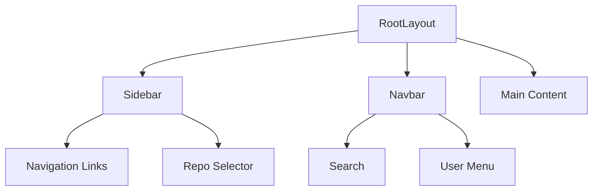
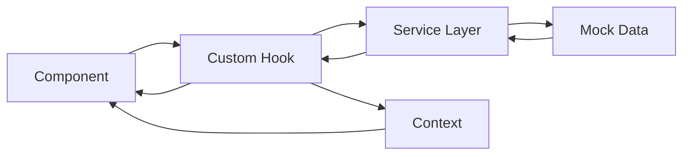

# IncidentOS Frontend Architecture Plan

## Tech Stack

- **Framework**: Next.js 15 (App Router)
- **Language**: TypeScript
- **Styling**: TailwindCSS
- **Component Library**: shadcn/ui
- **Charts**: Recharts
- **Animations**: Framer Motion
- **State Management**: React Context + Hooks
- **Graph Visualization**: React Flow
- **Icons**: Lucide React

## Project Structure

```
frontend/
├── app/                          # Next.js App Router pages
│   ├── layout.tsx               # Root layout with Sidebar + Navbar
│   ├── page.tsx                 # Landing/home page
│   ├── upload/                  # Repository upload page
│   ├── dashboard/               # Main dashboard
│   ├── fragility/               # Fragility analysis page
│   ├── graphs/                  # Dependency graph visualization
│   ├── mentor/                  # AI mentor chat interface
│   └── investigation/           # Investigation timeline
├── components/
│   ├── layout/                  # Layout components
│   │   ├── Sidebar.tsx         # Navigation sidebar
│   │   ├── Navbar.tsx          # Top navigation bar
│   │   └── AppLayout.tsx       # Combined layout wrapper
│   ├── dashboard/               # Dashboard-specific components
│   │   ├── StatsCard.tsx       # Statistics card
│   │   ├── FragileServiceCard.tsx
│   │   ├── IncidentCard.tsx
│   │   └── DependencyStats.tsx
│   ├── upload/
│   │   └── RepoUploadCard.tsx  # Drag-and-drop upload UI
│   ├── fragility/
│   │   ├── FragilityChart.tsx  # Score visualization
│   │   └── ServiceScoreCard.tsx
│   ├── graphs/
│   │   └── DependencyGraph.tsx # React Flow graph
│   ├── mentor/
│   │   ├── ChatInterface.tsx   # Chat UI
│   │   ├── MessageBubble.tsx
│   │   └── ChatInput.tsx
│   ├── investigation/
│   │   ├── Timeline.tsx        # Investigation timeline
│   │   └── TimelineEvent.tsx
│   └── ui/                      # shadcn/ui components
│       ├── button.tsx
│       ├── card.tsx
│       ├── badge.tsx
│       ├── skeleton.tsx
│       ├── input.tsx
│       ├── textarea.tsx
│       └── ...
├── services/
│   ├── api.ts                   # API client configuration
│   ├── mockData.ts              # Mocked API responses
│   ├── repoService.ts           # Repository operations
│   ├── dashboardService.ts      # Dashboard data
│   ├── fragilityService.ts      # Fragility analysis
│   ├── graphService.ts          # Dependency graph data
│   ├── mentorService.ts         # Mentor chat
│   └── investigationService.ts  # Investigation operations
├── hooks/
│   ├── useRepo.ts               # Repository state hook
│   ├── useDashboard.ts          # Dashboard data hook
│   ├── useFragility.ts          # Fragility data hook
│   ├── useGraph.ts              # Graph data hook
│   ├── useMentor.ts             # Mentor chat hook
│   └── useInvestigation.ts      # Investigation hook
├── types/
│   ├── api.ts                   # API contract types
│   ├── repo.ts                  # Repository types
│   ├── dashboard.ts             # Dashboard types
│   ├── fragility.ts             # Fragility types
│   ├── graph.ts                 # Graph types
│   ├── mentor.ts                # Mentor types
│   └── investigation.ts         # Investigation types
├── lib/
│   ├── utils.ts                 # Utility functions
│   └── constants.ts             # App constants
└── context/
    └── AppContext.tsx           # Global app state
```

## Component Architecture

### Layout Components



### Page Components

#### Dashboard Page

- StatsCard (services, dependencies, incidents)
- FragileServiceCard (list with scores)
- IncidentCard (recent incidents)
- DependencyStats (visual stats)

#### Upload Page

- RepoUploadCard (drag-and-drop)
- URL input field
- Upload progress indicator

#### Fragility Page

- FragilityChart (Recharts bar/line chart)
- ServiceScoreCard (detailed breakdown)
- Filtering and sorting controls

#### Graphs Page

- DependencyGraph (React Flow)
- Interactive nodes and edges
- Zoom and pan controls
- Node details panel

#### Mentor Page

- ChatInterface (message list)
- MessageBubble (user/AI messages)
- ChatInput (text input with send)
- Suggested questions

#### Investigation Page

- Timeline (vertical timeline)
- TimelineEvent (incident events)
- Root cause analysis card
- Recommended actions

## Data Flow



## API Integration Strategy

All API calls will use mocked data initially:

1. **Service Layer**: Each service file exports functions that return mocked data
2. **Custom Hooks**: Hooks call service functions and manage loading/error states
3. **Components**: Components use hooks to fetch and display data
4. **Future Backend**: Replace mock functions with real API calls without changing component code

## Styling Guidelines

### Color Palette

- **Background**: slate-950, slate-900
- **Cards**: slate-800/50 with backdrop-blur (glassmorphism)
- **Text**: slate-100, slate-300
- **Accents**: blue-500, purple-500, emerald-500
- **Borders**: slate-700, slate-600

### Design Patterns

- **Cards**: Rounded corners, subtle shadows, glassmorphism effect
- **Buttons**: Gradient backgrounds, hover effects
- **Inputs**: Dark with focus rings
- **Charts**: Dark theme with gradient fills
- **Animations**: Smooth transitions, fade-ins, slide-ins

### Responsive Breakpoints

- **Mobile**: < 640px
- **Tablet**: 640px - 1024px
- **Desktop**: > 1024px

## Component Specifications

### Sidebar

- Fixed left position
- Width: 256px (desktop), collapsible (mobile)
- Navigation links with icons
- Active state highlighting
- Repository selector dropdown

### Navbar

- Fixed top position
- Height: 64px
- Logo/branding on left
- Search bar in center
- User menu on right

### StatsCard

- Displays single metric
- Icon, value, label, change indicator
- Gradient border on hover
- Click to navigate to detail page

### FragileServiceCard

- Service name and score (0-10)
- Visual score indicator (progress bar/gauge)
- Reason badges
- Click to view details

### DependencyGraph

- React Flow canvas
- Custom node styling
- Edge styling with arrows
- Zoom controls
- Minimap
- Node click to show details

### ChatInterface

- Message list with auto-scroll
- User messages (right-aligned)
- AI messages (left-aligned)
- Typing indicator
- Suggested questions as chips

### Timeline

- Vertical timeline with events
- Event cards with timestamps
- Status indicators (success, warning, error)
- Expandable event details

## Implementation Phases

### Phase 1: Foundation (Tasks 4-6)

- Install dependencies
- Define TypeScript types
- Create service layer with mocked data

### Phase 2: Layout (Tasks 7-9)

- Build Sidebar component
- Build Navbar component
- Update root layout

### Phase 3: Core Components (Tasks 10-12)

- Create Card component
- Create LoadingSkeleton component
- Create Badge component

### Phase 4: Pages (Tasks 13-21)

- Implement all page components
- Integrate with services
- Add interactivity

### Phase 5: Polish (Tasks 22-27)

- Add animations
- Implement dark theme styling
- Responsive design
- Error handling
- Testing

## Key Features

### Modern UI Elements

- Glassmorphism cards with backdrop-blur
- Gradient accents and highlights
- Smooth hover effects and transitions
- Skeleton loading states
- Toast notifications for actions

### Developer Experience

- Clean, modular code structure
- Reusable components
- Type-safe with TypeScript
- Easy to extend and maintain
- Clear separation of concerns

### Performance

- Code splitting with Next.js
- Lazy loading for heavy components
- Optimized images
- Minimal bundle size

## Next Steps

1. Install required dependencies
2. Set up TypeScript types for API contracts
3. Create mocked data services
4. Build layout components
5. Implement page components
6. Add styling and animations
7. Test and refine

This architecture provides a solid foundation for building a modern, scalable, and maintainable frontend for IncidentOS.
